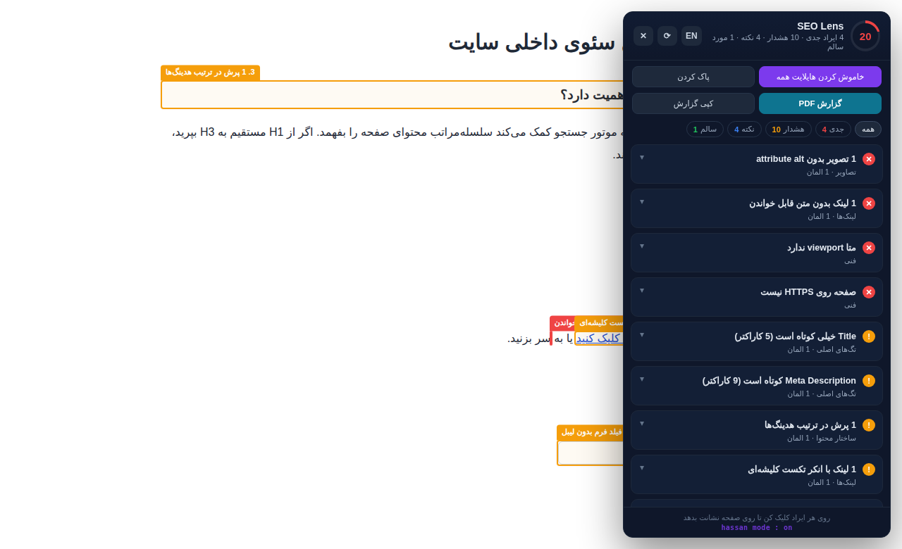

# SEO Lens — تحلیل سئو با هایلایت روی صفحه

> [English README](README.md)

اکستنشن کروم که بیش از ۴۰ ایراد سئوی هر صفحه را پیدا می‌کند، **دقیقاً همان المان مشکل‌دار را روی صفحه قاب می‌گیرد**، و خروجی گزارش PDF با لوگو می‌دهد. دوزبانه: فارسی و انگلیسی.

بیشتر ابزارهای سئو یک لیست به تو می‌دهند. این یکی نشانت می‌دهد **کجا** — روی هر ایراد کلیک کنی، صفحه تا آن المان اسکرول می‌کند و دورش یک قاب برچسب‌دار می‌کشد.



## نصب

### با اسکریپت (ویندوز)

در PowerShell:

```powershell
irm https://raw.githubusercontent.com/hassan95eb/seo-extension/main/install.ps1 | iex
```

این دستور آخرین نسخه را دانلود می‌کند، در `%LOCALAPPDATA%\SEO Lens` باز می‌کند، سالم بودن
manifest را چک می‌کند و مسیر پوشه را در کلیپ‌بوردت می‌گذارد. بعد در کروم:

۱. برو به `chrome://extensions`
۲. **Developer mode** را روشن کن (بالا سمت راست)
۳. **Load unpacked** را بزن و مسیر را پیست کن (`Ctrl+V`)
۴. آیکون ذره‌بین بنفش را پین کن

اگر ترجیح می‌دهی اول خود اسکریپت را بخوانی — که عادت درستی است، برای هر دستور
`irm | iex` — اول دانلودش کن:

```powershell
curl.exe -L -o install.ps1 https://raw.githubusercontent.com/hassan95eb/seo-extension/main/install.ps1
powershell -ExecutionPolicy Bypass -File .\install.ps1
```

`-ExecutionPolicy Bypass` لازم است چون ویندوز به‌صورت پیش‌فرض جلوی اجرای اسکریپت‌های دانلودشده
را می‌گیرد.

**گزینه‌ها**

| فلگ | کارکرد |
|---|---|
| `-Path <dir>` | نصب در مسیری غیر از `%LOCALAPPDATA%\SEO Lens` |
| `-Version v2.1.0` | نصب یک نسخه‌ی مشخص به‌جای آخرین نسخه |
| `-Force` | نصب مجدد حتی وقتی همان نسخه از قبل نصب است |

برای پاس دادن فلگ از طریق همان دستور تک‌خطی:

```powershell
& ([scriptblock]::Create((irm https://raw.githubusercontent.com/hassan95eb/seo-extension/main/install.ps1))) -Path D:\Tools\SEOLens
```

**آپدیت:** همان اسکریپت را دوباره اجرا کن. هر بار در همان مسیر نصب می‌کند، پس کروم افزونه را
از دست نمی‌دهد — کافی است دکمه‌ی ⟳ روی کارت SEO Lens را بزنی. اگر از قبل به‌روز باشی، فقط یک
درخواست به GitHub می‌زند و هیچ چیزی را عوض نمی‌کند.

### دستی

**از Release:** آخرین ZIP را از بخش [Releases](../../releases) دانلود و آنزیپ کن.
**از سورس:** مخزن را کلون کن.

سپس:

۱. برو به `chrome://extensions`
۲. **Developer mode** را روشن کن
۳. **Load unpacked** → پوشه پروژه را انتخاب کن
۴. آیکون ذره‌بین بنفش را پین کن

### چرا مراحل آخر خودکار نشده

کروم قبلاً یک فلگ خط فرمان به اسم `--load-extension` داشت که با آن می‌شد نصب را کاملاً خودکار
کرد. این فلگ [در کروم ۱۳۷ حذف شد](https://developer.chrome.com/blog/extension-news-june-2025)
و دقیقاً به همین دلیل که هیچ اسکریپتی نتواند بی‌سروصدا به مرورگر کسی افزونه اضافه کند. الان
لود کردن افزونه‌ی unpacked یک اقدام آگاهانه در رابط خود کروم است و هیچ نصب‌کننده‌ای — از جمله
همین یکی — نمی‌تواند جای کاربر انجامش دهد.

از هر مسیری که رفتی: **پوشه را جابه‌جا یا پاک نکن.** کروم افزونه‌ی unpacked را کپی نمی‌کند،
بلکه هر بار که بالا می‌آید از همان مسیر می‌خواندش. اگر پوشه برود، افزونه هم می‌رود.

## استفاده

- آیکون را روی هر صفحه‌ای بزن → پنل تحلیل باز می‌شود.
- روی هر ایراد کلیک کن → صفحه تا آن المان اسکرول می‌کند و دورش قاب رنگی + برچسب کشیده می‌شود.
- **هایلایت همه ایرادها** → همه المان‌های مشکل‌دار هم‌زمان شماره‌گذاری و قاب‌بندی می‌شوند.
- **گزارش PDF** → تب گزارش باز می‌شود؛ دکمه «ذخیره به‌صورت PDF / چاپ» را بزن و در پنجره چاپ مقصد را روی **Save as PDF** بگذار.
- **کپی گزارش** → گزارش متنی در کلیپ‌بورد، آماده برای تیکت و تسک.
- دکمه **EN / فا** زبان را عوض می‌کند و انتخابت ذخیره می‌شود.
- `Esc` پنل را می‌بندد. هدر پنل قابل درگ است.

## گزارش PDF


- سربرگ شامل **لوگو، نام سایت، آدرس صفحه و تاریخ** (تاریخ شمسی وقتی زبان گزارش فارسی است).
- لوگو خودکار از favicon یا apple-touch-icon سایت برداشته می‌شود.
- با **انتخاب لوگوی سفارشی** می‌توانی لوگوی آژانس خودت را بگذاری؛ ذخیره می‌شود و روی گزارش‌های بعدی هم می‌ماند — مناسب گزارش وایت‌لیبل به مشتری.
- قالب A4، فونت وزیرمتن embed شده، رنگ‌بندی مناسب چاپ، جدا شدن درست بخش‌ها بین صفحات.

## چک‌ها

| دسته | موارد |
|---|---|
| **تگ‌های اصلی** | title و meta description — وجود، طول، تکراری بودن |
| **ساختار محتوا** | نبود / چندتایی / مخفی / خالی بودن H1، پرش سطح هدینگ‌ها، هدینگ خالی، حجم محتوا |
| **تصاویر** | نبود alt، alt خالی روی تصویر محتوایی، alt بیش‌ازحد بلند، نام فایل بی‌معنی |
| **پرفورمنس** | نبود width/height (CLS)، تصویر بزرگ‌تر از نیاز، نبود lazy-load، اسکریپت بلاک‌کننده رندر |
| **لینک‌ها** | لینک بدون متن، انکر تکست کلیشه‌ای، `href="#"`، `<a>` بدون href، `target="_blank"` بدون `noopener`، nofollow داخلی، نبود لینک داخلی |
| **ایندکس** | canonical (نبود / تکراری / خالی / اشاره به آدرس دیگر)، noindex، nofollow سراسری، `lang`، hreflang بدون self-reference |
| **شبکه‌های اجتماعی** | کامل بودن Open Graph، `twitter:card` |
| **داده ساختاریافته** | وجود JSON-LD/microdata، خراب بودن JSON، نمایش نوع اسکیما |
| **فنی** | viewport، غیرفعال بودن زوم، charset، favicon، HTTPS، محتوای مخلوط، ساختار URL |
| **دسترسی‌پذیری** | iframe بدون title، فیلد فرم بدون لیبل |

## امتیازدهی

از ۱۰۰ شروع می‌شود: هر ایراد جدی ۹−، هر هشدار ۴−، هر نکته ۱−.

مواردی که فقط اندازه‌گیری‌اند و قضاوتی در آن‌ها نیست — فعلاً شمارش لینک‌های داخلی و خارجی —
شدت جداگانه‌ی **آمار** دارند. در پنل و گزارش نمایش داده می‌شوند ولی هیچ امتیازی کم نمی‌کنند،
پس صفحه‌ای که هیچ ایرادی ندارد واقعاً به ۱۰۰ از ۱۰۰ می‌رسد.

## دسترسی‌ها

اکستنشن فقط **`activeTab` و `scripting` و `storage`** می‌خواهد — بدون host permission و بدون
content script. تا وقتی روی آیکون کلیک نکنی هیچ کدی روی هیچ صفحه‌ای اجرا نمی‌شود؛ آن کلیک فقط
به همان یک تب و همان یک بازدید دسترسی می‌دهد. به همین دلیل کروم هنگام نصب هشدار «خواندن و
تغییر داده‌های شما در همه‌ی سایت‌ها» را نشان نمی‌دهد.

نتیجه‌ی تحلیل هیچ‌وقت از مرورگر خارج نمی‌شود. داده‌ی گزارش PDF از طریق `chrome.storage.local`
به تب گزارش تحویل داده می‌شود و به‌محض خوانده‌شدن پاک می‌شود — تنها چیزهایی که عمداً نگه داشته
می‌شوند زبان انتخابی و لوگوی سفارشی تو هستند.

## نکته

- روی صفحات داخلی کروم (`chrome://`، وب‌استور) کار نمی‌کند — محدودیت خود کروم است.
- برای فایل‌های محلی، «Allow access to file URLs» را در تنظیمات اکستنشن روشن کن.
- همه‌چیز سمت کلاینت اجرا می‌شود؛ هیچ داده‌ای به هیچ سروری فرستاده نمی‌شود.

## نسخه ۲.۱ — چه چیزی عوض شد و چطور بررسی‌اش کنی

نسخه ۲.۱ یک پاس امنیتی و پاک‌سازی روی ۲.۰ است. هیچ قابلیتی حذف نشده. برای هر تغییر، دلیل،
فایل‌های دست‌خورده و راه دقیق بررسی آمده است.

### ۱. اکستنشن دیگر روی هر صفحه‌ای که باز می‌کنی اجرا نمی‌شود

**قبل:** در `manifest.json` هم `content_scripts` روی `<all_urls>` بود و هم
`host_permissions: <all_urls>`. یعنی حدود ۷۲ کیلوبایت جاوااسکریپت روی **هر بار لود هر صفحه‌ای**
پارس و اجرا می‌شد — به‌علاوه‌ی دو listener سراسری `scroll` و `resize` — حتی اگر هیچ‌وقت روی
آیکون کلیک نمی‌کردی. کروم هم موقع نصب هشدار «خواندن و تغییر همه‌ی داده‌های شما در همه‌ی
سایت‌ها» را نشان می‌داد.

**حالا:** هر دو بلاک حذف شدند. `background.js` از قبل هنگام کلیک با
`chrome.scripting.executeScript` اسکریپت‌ها را تزریق می‌کرد، پس آن اعلان استاتیک کاملاً اضافه
بود. دسترسی‌های باقی‌مانده: `activeTab`، `scripting`، `storage`. بلاک
`web_accessible_resources` هم حذف شد: صفحه‌ی گزارش به‌عنوان یک صفحه‌ی اکستنشن باز می‌شود
(`chrome-extension://…/report.html`) و فقط منابعی که **صفحات وب** لود می‌کنند باید آن‌جا
فهرست شوند.

*فایل‌ها:* `manifest.json`، `background.js`

**بررسی:** اکستنشن را لود کن و در `chrome://extensions` وارد **Details** شو؛ دیگر نباید اسمی از
همه‌ی سایت‌ها در فهرست دسترسی‌ها باشد. بعد یک صفحه‌ی معمولی را با DevTools باز کن و به تب
**Sources** برو؛ تا وقتی روی آیکون کلیک نکرده‌ای نباید هیچ اسکریپتی از `seo-lens` آن‌جا باشد.

### ۲. حالا یک صفحه‌ی سالم می‌تواند ۱۰۰ از ۱۰۰ بگیرد

**قبل:** آمار لینک‌ها (`A_STATS`) با شدت `info` ثبت می‌شد و فرمول امتیاز به ازای هر نکته یک
نمره کم می‌کند. چون این آیتم روی **هر** صفحه‌ای اضافه می‌شود، هیچ صفحه‌ای نمی‌توانست بالاتر از
۹۹ بگیرد — و شمارنده‌ی «نکته» هم همیشه یکی بیشتر از واقعیت بود.

**حالا:** در `audit.js` شدت پنجمی به نام `stat` اضافه شد برای اندازه‌گیری‌های خنثی. این شدت از
امتیاز و از شمارنده‌های ایراد/هشدار/نکته کنار گذاشته شده و در `counts.stats` جدا گزارش می‌شود.
همچنان در پنل و گزارش دیده می‌شود، با برچسب خاکستری **آمار**.

*فایل‌ها:* `audit.js`، `i18n.js`، `content.js`، `report.js`، `report.css`

**بررسی:** یک صفحه‌ی خوب‌بهینه‌شده را تحلیل کن و ببین امتیاز می‌تواند به ۱۰۰ برسد. روی هر
صفحه‌ای، ردیف آمار لینک‌ها حالا برچسب خاکستری «آمار» دارد نه برچسب آبی «نکته»، و شمارنده‌ی
نکته یکی کمتر از نسخه ۲.۰ است.

### ۳. داده‌ی گزارش یک بافر تحویل است، نه تاریخچه‌ی ذخیره‌شده

**قبل:** داده‌ی گزارش — آدرس صفحه‌ی تحلیل‌شده، عنوان و تکه‌متن‌های برداشته‌شده از صفحه — با
کلید ثابت `seoLensReport` در `chrome.storage.local` نوشته می‌شد و برای همیشه آن‌جا می‌ماند. هر
گزارش جدید هم بی‌صدا روی قبلی می‌نوشت.

**حالا:** هر خروجی روی یک کلید یکتا نوشته می‌شود
(`seoLensReport:<timestamp>-<random>`)، قبلش باقی‌مانده‌های اجراهای قبلی جارو می‌شوند، و
صفحه‌ی گزارش **به‌محض خواندن، کلید را پاک می‌کند**. برای اینکه رفرش کردن تب گزارش خرابش نکند،
داده در `sessionStorage` همان تب کپی می‌شود که مرورگر با بسته‌شدن تب پاکش می‌کند.

*فایل‌ها:* `content.js`، `report.js`

**بررسی:** یک گزارش بگیر، بعد DevTools سرویس‌ورکر اکستنشن را باز کن و
`chrome.storage.local.get(null, console.log)` را اجرا کن — باید فقط `seoLensLang` و
`seoLensLogo` را ببینی و هیچ داده‌ی گزارشی نباشد. رفرش کردن تب گزارش همچنان کار می‌کند؛ بستن و
باز کردن دوباره‌اش نه.

### ۴. زبان پنل و گزارش PDF همیشه یکی است

**قبل:** پنل در اولین اجرا زبان را از `navigator.language` تشخیص می‌داد ولی نتیجه را ذخیره
نمی‌کرد، در حالی که صفحه‌ی گزارش به `"fa"` هاردکد برمی‌گشت. یعنی کاربر انگلیسی‌زبانی که هرگز
دکمه‌ی زبان را نزده بود، پنل انگلیسی و PDF فارسی می‌گرفت.

**حالا:** هر دو طرف از یک `detectLang()` مشترک استفاده می‌کنند و پنل مقدار تشخیص‌داده‌شده را در
همان اجرای اول ذخیره می‌کند تا همه جا یک جواب واحد خوانده شود.

*فایل‌ها:* `content.js`، `report.js`

**بررسی:** استوریج اکستنشن را خالی کن، زبان کروم را انگلیسی بگذار، پنل را باز کن و بدون
دست‌زدن به دکمه‌ی زبان یک گزارش بگیر — هر دو باید انگلیسی باشند.

### ۵. هیچ رشته‌ی نمایشی در موتور تحلیل نمانده

قاعده‌ی طراحی نسخه ۲.۰ این است که `audit.js` فقط `code` و `params` بدهد و هیچ متن قابل‌خواندن
برای آدم نداشته باشد. دو مورد جا مانده بود:

- `background.js` پیام `"SEO Lens: تزریق ناموفق"` را لاگ می‌کرد — حالا یک لاگ انگلیسیِ مخصوص
  توسعه‌دهنده است.
- `audit.js` خودش رشته‌ی `" · N nofollow"` را می‌ساخت و به‌عنوان پارامتر پاس می‌داد. حالا دو کد
  پیام جدا داریم، `A_STATS` و `A_STATS_NF`، موتور فقط یک عدد خام می‌فرستد و `i18n.js` تصمیم
  می‌گیرد در هر زبان چطور نوشته شود.

*فایل‌ها:* `background.js`، `audit.js`، `i18n.js`

**بررسی:** دستور
`grep -P '[\x{0600}-\x{06FF}]' audit.js background.js content.js report.js`
هیچ خروجی‌ای نمی‌دهد — یعنی هیچ متن فارسی‌ای بیرون از `i18n.js` و `_locales/` نمانده.

### مواردی که در همین پاس اضافه شد

- **ساده‌سازی `isInjectable()`** (`background.js`). حلقه‌ی `BAD_SCHEMES` عملاً هیچ‌وقت اجرا
  نمی‌شد — چون `return` آخر از قبل فقط `http`/`https`/`file` را مجاز می‌کرد — و شرط مربوط به
  وب‌استور به تقدم عملگرها تکیه داشت. حالا به شکل یک allow-list صریح بازنویسی شده، با همان
  رفتار قبلی.
- **اعتبارسنجی آدرس favicon** (`report.js`). لوگوی سربرگ گزارش از صفحه‌ی تحلیل‌شده می‌آید،
  یعنی ورودی نامطمئنی که روی یک صفحه‌ی اکستنشن رندر می‌شود. تابع `safeImageSrc()` حالا فقط
  `http:` و `https:` و `data:image/…` را قبول می‌کند؛ هر چیز دیگری (`javascript:` و امثالش)
  دور ریخته می‌شود و لوگو مخفی می‌ماند.

---

**hassan mode : on** — ساخته‌شده توسط [hassan95eb](https://github.com/hassan95eb)

MIT © hassan95eb
