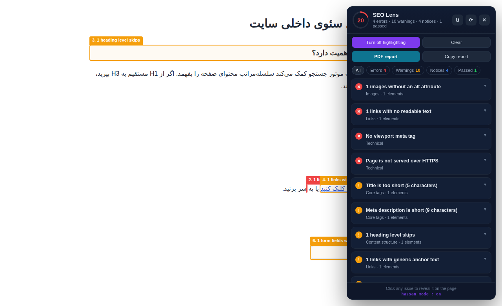
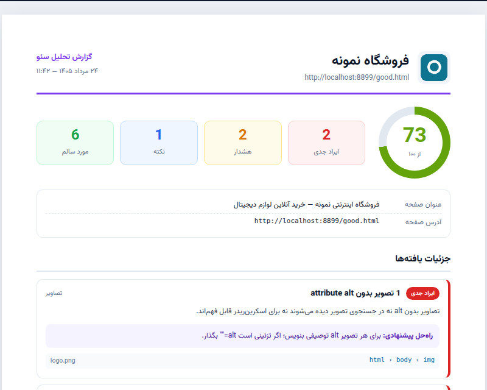

# SEO Lens

[](https://github.com/hassan95eb)
[](LICENSE)
[](manifest.json)

A Chrome extension that audits any page for 40+ SEO issues, **outlines the exact broken element on the page**, and exports a branded PDF report. Bilingual: English and Persian.

Most SEO extensions hand you a list. This one shows you *where* — click an issue and the page scrolls to the offending element and draws a labelled box around it.

> 🇮🇷 [نسخه فارسی این راهنما](README.fa.md)



## Install

**From a release:** download the latest ZIP from [Releases](../../releases) and unzip it.
**From source:** clone this repository.

Then:

1. Open `chrome://extensions`
2. Enable **Developer mode**
3. Click **Load unpacked** and select the folder
4. Pin the purple lens icon to your toolbar

## Usage

- Click the icon on any page — the audit panel opens.
- Click any issue — the page scrolls to that element and outlines it with a colour-coded box and label.
- **Highlight all issues** — outlines and numbers every problem element at once.
- **PDF report** — opens a print-ready report tab; hit "Save as PDF / Print" and choose **Save as PDF** as the destination.
- **Copy report** — plain-text report on the clipboard, ready for a ticket.
- The **EN / فا** button switches language; your choice is remembered.
- `Esc` closes the panel. The panel header is draggable.

## PDF report



- Header carries the **logo, site name, page URL and date** (Persian calendar when the report language is Persian).
- The logo is pulled automatically from the site's favicon or apple-touch-icon.
- **Choose custom logo** lets you drop in your own agency logo — it's stored and reused on every later report, which makes the output usable as a white-label client deliverable.
- A4 layout, embedded Vazirmatn font, print-safe colours, clean page breaks.
- Report language can be switched right on the report page.

## What it checks

| Group | Checks |
|---|---|
| **Core tags** | title and meta description — presence, length, duplicates |
| **Content structure** | missing / multiple / hidden / empty H1, heading level skips, empty headings, word count |
| **Images** | missing alt, empty alt on content images, overly long alt, generic filenames |
| **Performance** | missing width/height (CLS), images served larger than displayed, missing lazy-load, render-blocking scripts |
| **Links** | empty anchor text, generic anchors, `href="#"`, `<a>` without href, `target="_blank"` without `noopener`, nofollowed internal links, no internal links, link counts |
| **Indexability** | canonical (missing / duplicate / empty / pointing elsewhere), noindex, page-level nofollow, `lang`, non-self-referencing hreflang |
| **Social** | Open Graph completeness, `twitter:card` |
| **Structured data** | JSON-LD / microdata presence, malformed JSON, detected schema types |
| **Technical** | viewport, disabled zoom, charset, favicon, HTTPS, mixed content, URL shape |
| **Accessibility** | iframes without a title, form fields without labels |

## Scoring

Starts at 100: −9 per error, −4 per warning, −1 per notice.

Purely descriptive measurements — currently the internal/external link counts — carry the
separate **Stats** severity. They are shown in the panel and the report but cost no points, so
a page with nothing wrong actually reaches 100/100.

## Permissions

The extension requests **`activeTab`, `scripting` and `storage`** — no host permissions and no
content scripts. Nothing runs on any page until you click the toolbar icon; that click grants
access to that one tab, for that one visit. Chrome therefore shows no "read and change your
data on all websites" warning at install time.

Audit results never leave the browser. The PDF report is handed to the report tab through
`chrome.storage.local` and deleted the moment that tab has read it — the only things kept on
purpose are your language choice and your custom logo.

## Project layout

```
manifest.json          extension config (MV3)
background.js          service worker — panel toggle, badge, report tab
i18n.js                full string catalogue for both languages (the only file to touch for a new language)
audit.js               audit engine — language-agnostic, emits code + params only
content.js             panel, highlight system, exports
report.html/.css/.js   print-ready report page
fonts/                 Vazirmatn (Regular + Bold) for the PDF output
_locales/              store name and description (en + fa)
```

Adding a third language means adding one key to `i18n.js` — nothing else changes.

## Notes

- Chrome blocks extensions on its own internal pages (`chrome://`, the Web Store), so the panel won't open there.
- For `file://` pages, enable "Allow access to file URLs" in the extension's settings.
- Everything runs client-side. No data is sent anywhere.

## v2.1 — what changed and how to check it

v2.1 is a hardening pass over v2.0. No feature was removed. Each change below lists the reason,
the files touched, and the exact way to confirm it yourself.

### 1. The extension no longer runs on every page you visit

**Before:** `manifest.json` declared `content_scripts` matching `<all_urls>` plus
`host_permissions: <all_urls>`. About 72 KB of JavaScript was parsed and executed on every page
load — plus two global `scroll`/`resize` listeners — even if the icon was never clicked. Chrome
warned "Read and change all your data on all websites" at install.

**Now:** both blocks are gone. `background.js` already injected the scripts on click via
`chrome.scripting.executeScript`, so the static declaration was pure redundancy. The remaining
permissions are `activeTab`, `scripting`, `storage`. `web_accessible_resources` was dropped too:
the report page is opened as an extension page (`chrome-extension://…/report.html`), and only
resources loaded *by web pages* need to be listed there.

*Files:* `manifest.json`, `background.js`

**Check it:** load the unpacked extension and open `chrome://extensions` → **Details**. The
permissions list should no longer mention all websites. Then open any page with DevTools →
**Sources**; no `seo-lens` script should be listed until you click the toolbar icon.

### 2. A clean page can now score 100/100

**Before:** the link-count summary (`A_STATS`) was emitted with `info` severity, and the scoring
formula subtracts one point per notice. Because that item is added on every single page, no page
could ever score above 99 — and the "Notices" counter was permanently inflated by one.

**Now:** `audit.js` has a fifth severity, `stat`, for neutral measurements. It is excluded from
the score and from the error/warning/notice counters, and reported under its own `counts.stats`.
It still appears in the panel and the report, with a grey **Stats** badge.

*Files:* `audit.js`, `i18n.js`, `content.js`, `report.js`, `report.css`

**Check it:** audit a well-optimised page and confirm the score can reach 100. On any page, the
link-count row now carries the grey "Stats" badge instead of the blue "Notice" badge, and the
Notices counter is one lower than in v2.0.

### 3. Report data is a hand-off buffer, not stored history

**Before:** the report payload — the audited URL, page title and text snippets pulled from the
page — was written to `chrome.storage.local` under the fixed key `seoLensReport` and left there
indefinitely. Every new report silently overwrote the previous one.

**Now:** each export writes to a unique key (`seoLensReport:<timestamp>-<random>`), sweeps any
leftovers from earlier runs first, and the report page **deletes the key as soon as it has read
it**. So the tab can still survive a refresh, the payload is copied into that tab's
`sessionStorage`, which the browser clears when the tab closes.

*Files:* `content.js`, `report.js`

**Check it:** export a report, then open DevTools on the extension's service worker and run
`chrome.storage.local.get(null, console.log)` — you should see only `seoLensLang` and
`seoLensLogo`, no report payload. Refreshing the report tab still re-renders the report;
closing and reopening it does not.

### 4. Panel and PDF report always agree on the language

**Before:** on first run the panel detected the language from `navigator.language` but never
saved the result, while the report page fell back to a hardcoded `"fa"`. An English-speaking
user who had never touched the language button got an English panel and a Persian PDF.

**Now:** both sides share the same `detectLang()` logic, and the panel persists the detected
value on first run so every surface reads one stored answer.

*Files:* `content.js`, `report.js`

**Check it:** clear the extension's storage, set Chrome's language to English, open the panel
and export a report without touching the language button — both should be English.

### 5. No display strings left in the audit engine

v2.0's design rule is that `audit.js` emits only `code` + `params` and holds no human-readable
text. Two leaks remained:

- `background.js` logged `"SEO Lens: تزریق ناموفق"` — now an English developer-facing log.
- `audit.js` built the string `" · N nofollow"` itself and passed it in as a parameter. There
  are now two message codes, `A_STATS` and `A_STATS_NF`, and the engine passes a plain number;
  `i18n.js` decides the wording in each language.

*Files:* `background.js`, `audit.js`, `i18n.js`

**Check it:** `grep -P '[\x{0600}-\x{06FF}]' audit.js background.js content.js report.js`
returns nothing — no Persian text outside `i18n.js` and `_locales/`.

### Extras bundled into the same pass

- **`isInjectable()` simplified** (`background.js`). The `BAD_SCHEMES` loop was unreachable — the
  final `return` already allowed only `http`/`https`/`file` — and the Web Store host check
  relied on operator precedence. Rewritten as an explicit allow-list, same behaviour.
- **Favicon URLs are validated** (`report.js`). The report header's logo comes from the audited
  page, i.e. untrusted input rendered on an extension page. `safeImageSrc()` now permits only
  `http:`, `https:` and `data:image/…`; anything else (`javascript:` and friends) is dropped and
  the logo is hidden.

---

## Author

**hassan mode : on**

The signature sits in three places on the extension itself: the panel footer, the PDF report footer, and the end of the copied text report.

Built by [hassan95eb](https://github.com/hassan95eb) — [github.com/hassan95eb/seo-extension](https://github.com/hassan95eb/seo-extension)

## License

MIT © hassan95eb
